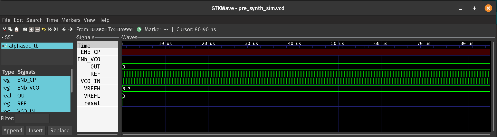
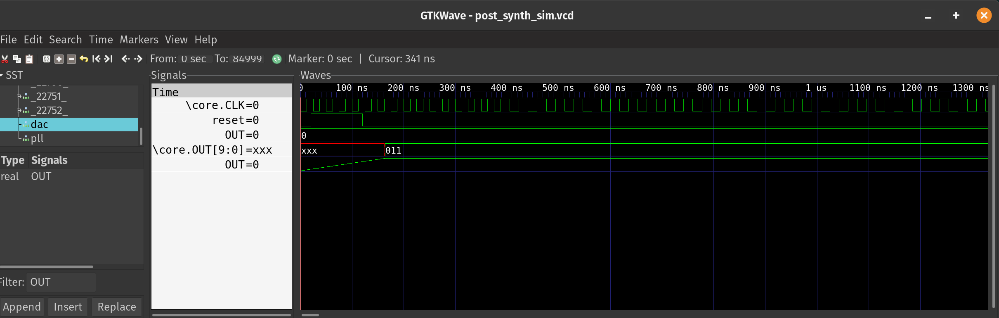

# AlphaCore
- AlphaCore is a RISC-V Processor made as a part of the VLSI Physical Design for ASICs course.
- AlphaCore is a simple RISC-V CPU, written in SystemVerilog.

### AlphaCore Block Diagram


## Modelling
### Running pre-synthesis simulations
- Here, we run our testbench to ensure our RISC-V processor is running correctly
- We use `iverilog` and `gtkwave` to run the testbench on our module with the following command:
```bash
iverilog -o output/pre_synth_sim/pre_synth_sim.out src/alphacore_tb.v -I src/module
cd output/pre_synth_sim
./pre_synth_sim.out
```
- It gives the following output:




### Running Synthesis
- In OpenLane container, we run the following commands:
```
cd /home/alphadelta1803/Desktop/projec
ts/pes_riscv_processor/src
yosys
```
- To synthesize our design, we execute the following commands in yosys:
```
read_verilog ./module/alphacore.v
read_liberty -lib ./lib/sky130_fd_sc_hd__tt_025C_1v80.lib
synth -top alphacore
dfflibmap -liberty ./lib/sky130_fd_sc_hd__tt_025C_1v80.lib
opt
abc -liberty ./lib/sky130_fd_sc_hd__tt_025C_1v80.lib -script +strash;scorr;ifraig;retime;{D};strash;dch,-f;map,-M,1,{D}
flatten
setundef -zero
clean -purge
rename -enumerate
stat
write_verilog -noattr ../output/synth/alphacore.synth.v
```
- After running these commands, we get a synthesized module with all of our individual components connected together in `alphacore.synth.v`, found [here](output/synth/alphacore.synth.v).
- These are the statistics of our design:
```
=== alphacore ===

   Number of wires:              13329
   Number of wire bits:          16691
   Number of public wires:       13329
   Number of public wire bits:   16691
   Number of memories:               0
   Number of memory bits:            0
   Number of processes:              0
   Number of cells:              16546
     sky130_fd_sc_hd__a211oi_1      38
     sky130_fd_sc_hd__a21boi_0       2
     sky130_fd_sc_hd__a21o_2         1
     sky130_fd_sc_hd__a21oi_1      165
     sky130_fd_sc_hd__a221oi_1       8
     sky130_fd_sc_hd__a31o_2         2
     sky130_fd_sc_hd__a31oi_1       11
     sky130_fd_sc_hd__and2_2        18
     sky130_fd_sc_hd__and2b_2       11
     sky130_fd_sc_hd__and3_2         2
     sky130_fd_sc_hd__clkinv_1    1177
     sky130_fd_sc_hd__dfrtp_1     3079
     sky130_fd_sc_hd__lpflow_inputiso0p_1     11
     sky130_fd_sc_hd__nand2_1     3710
     sky130_fd_sc_hd__nand3_1      486
     sky130_fd_sc_hd__nand3b_1       2
     sky130_fd_sc_hd__nand4_1     3067
     sky130_fd_sc_hd__nor2_1       479
     sky130_fd_sc_hd__nor3_1       218
     sky130_fd_sc_hd__nor3b_1        1
     sky130_fd_sc_hd__nor4_1        71
     sky130_fd_sc_hd__o2111a_1     130
     sky130_fd_sc_hd__o2111ai_1    165
     sky130_fd_sc_hd__o211a_1        2
     sky130_fd_sc_hd__o211ai_1      17
     sky130_fd_sc_hd__o21a_1         6
     sky130_fd_sc_hd__o21ai_0     3105
     sky130_fd_sc_hd__o21bai_1      18
     sky130_fd_sc_hd__o221a_2        1
     sky130_fd_sc_hd__o221ai_1      47
     sky130_fd_sc_hd__o22ai_1      409
     sky130_fd_sc_hd__o2bb2ai_1      1
     sky130_fd_sc_hd__o311ai_0       1
     sky130_fd_sc_hd__o31ai_1        1
     sky130_fd_sc_hd__o41ai_1       34
     sky130_fd_sc_hd__or2_2         13
     sky130_fd_sc_hd__xnor2_1       11
     sky130_fd_sc_hd__xor2_1        26
```
- The synthesis log can be found in [synth.log](output/synth/synth.log)

### Post-synthesis Simulation
- We use `iverilog` and `gtkwave` to run the testbench on our module with the following command:
```bash
iverilog -o output/post_synth_sim/post_synth_sim.out -DFUNCTIONAL -DUNIT_DELAY=#1 src/alphacore_tb_post.v -I src/module -I src/gls_model -I output/synth
cd output/post_synth_sim
./post_synth_sim.out
```
- It gives the following output:



