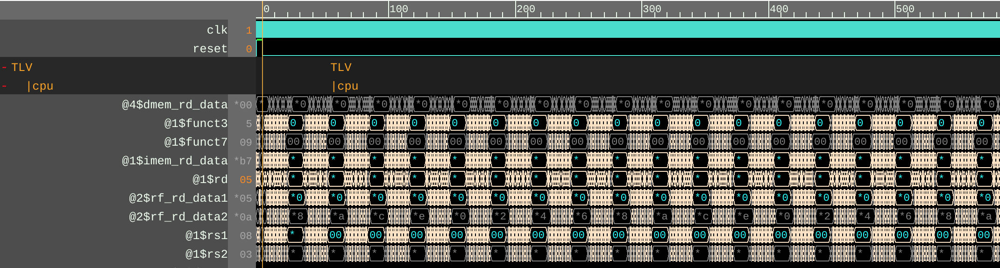
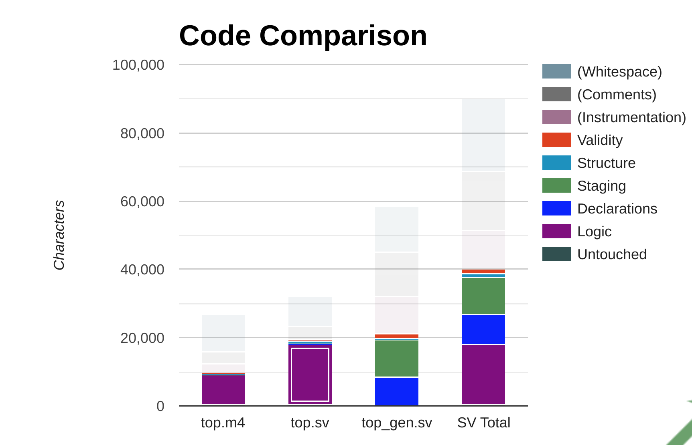

# pes_riscv_processor
- RISC-V Processor made as a part of the VLSI Physical Design for ASICs course

## Block Diagram

## Waveform 
- Short snippet of waveform

## Files
- [top.tlv](src/top.tlv): Generated after combining the library files with the TLV code written
- [top.sv](src/top.sv): Generated by Sandpiper (contains logic)
- [top_gen.sv](src/top_gen.sv): Generated by Sandpiper (contains declartions and staging)

