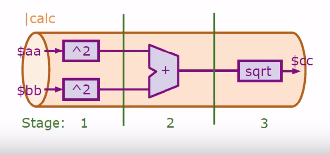
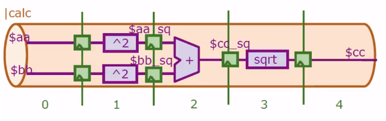
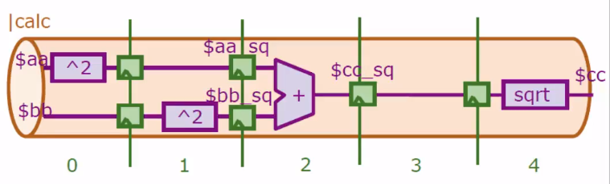

# pes_riscv_processor
- RISC-V Processor made as a part of the VLSI Physical Design for ASICs course

## Day 3 - Digital logic with TL-Verilog and Makerchip
### SK1: Combinational Logic - Labs
- [Combinational Logic Lab](https://makerchip.com/sandbox/0jRfjh5zP/0mwhjR8)
- [Vectors Lab](https://makerchip.com/sandbox/0jRfjh5zP/0qjh874)
- [MUX Lab](https://makerchip.com/sandbox/0jRfjh5zP/0vgh7yK)
- [ALU Lab](https://makerchip.com/sandbox/0jRfjh5zP/0wjhGR8)

### SK2: Sequential Logic - Labs
- [Counter Lab](https://makerchip.com/sandbox/0jRfjh5zP/02RhpEB)
- [Sequential Calculator Lab](https://makerchip.com/sandbox/0jRfjh5zP/0wjhGy8)

### SK3: Pipelined Logic - Labs
- Simple Pipeline:

```
|calc
   @1
      $aa_sq[31:0] = $aa * $aa;
      $bb_sq[31:0] = $bb * $bb;
   @2
      $cc_sq[31:0] = $aa_sq * $bb_sq;
   @3
      $cc[31:0] = sqrt($cc_sq);
```
- Retiming the pipeline:

```
|calc
   @1
      $aa_sq[31:0] = $aa * $aa;
      $bb_sq[31:0] = $bb * $bb;
   @2
      $cc_sq[31:0] = $aa_sq * $bb_sq;
   @3
      $cc[31:0] = sqrt($cc_sq);
```


```
|calc
   @0
      $aa_sq[31:0] = $aa * $aa;
   @1
      $bb_sq[31:0] = $bb * $bb;
   @2
      $cc_sq[31:0] = $aa_sq * $bb_sq;
   @4
      $cc[31:0] = sqrt($cc_sq);
```

- [2-cycle Calculator]()