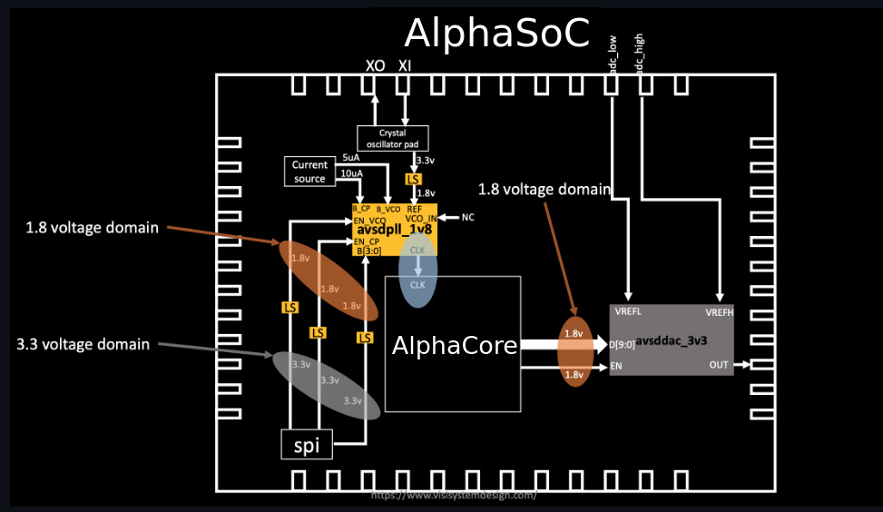
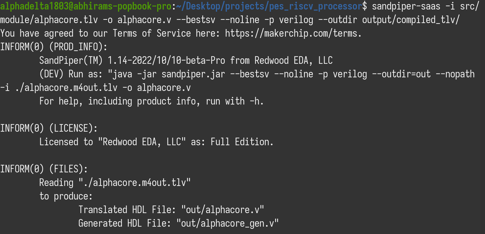
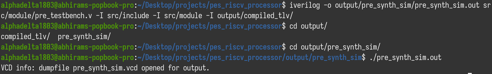

# AlphaSoC
- AlphaSoC is a RISC-V Processor made as a part of the VLSI Physical Design for ASICs course.
- This follows in the footsteps of [VSDBabySoC](https://github.com/manili/VSDBabySoC), using a similar layout and combining a RV core (based on RVMYTH course) with PLL and DAC to build a stand-alone SoC.

## Overall Architecture Block Diagaram




### AlphaCore 
- AlphaCore is a simple RISC-V CPU, written in TL-Verilog, made by following the RISC-V MYTH course by VSD and RedwoodEDA.

### PLL
- A Phase-locked loop is a control system that generate an output signal with a phase related to the phase of the input signal.
- A PLL is used for synchronization, and here we are using a PLL for clock generation
- We are using a PLL made by VSD-IP, called [avsdpll](https://github.com/vsdip/rvmyth_avsdpll_interface)

### DAC
- A digital-to-analog converter is used to convert digital signals to analog signals.
- A DAC is used for communication purposes, to enable the generation of digitally-defined transmission signals.
- We are using a DAC made by VSD-IP, called [avsddac](https://github.com/vsdip/rvmyth_avsddac_interface).

### AlphaCore Block Diagram


### Converting TL-Verilog file to Verilog
- We use Sandpiper-SaaS to convert our TL-Verilog processor to Verilog for synthesis and physical design, with the following command:
```bash
sandpiper-saas -i src/module/alphacore.tlv -o alphacore.v --bestsv --noline -p verilog --outdir output/compiled_tlv
```
- The output is as follows:



### Running pre-synthesis simulations
- Here, we increase/decrease the digital output value and feed it to the DAC. so we can watch the changes on the SoC output
- We use `iverilog` and `gtkwave` to run the testbench on our module with the following command:
```bash
iverilog -o output/pre_synth_sim/pre_synth_sim.out src/module/testbench.v -I src/include -I src/module -I output/compiled_tlv
cd output/pre_synth_sim
./pre_synth_sim.out
```
- It gives the following output:




## Files
- [alphacore.tlv](src/module/alphacore.tlv): The source TL-Verilog file
- [alpha_processor.sv](src/module/alpha_processor.sv): Generated by Sandpiper (contains logic)
- [alpha_processor_gen.sv](src/module/alpha_processor_gen.sv): Generated by Sandpiper (contains declartions and staging)


