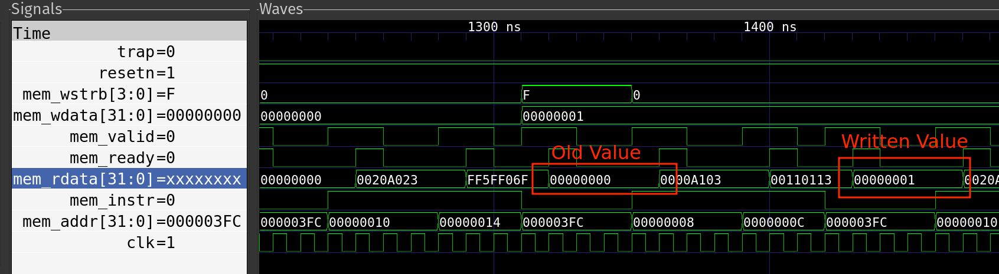

# AlphaCore
- AlphaSoc is a System-On-Chip which includes a RISC-V Processor, SPI Memory Controller, UART controller and a Onboard SRAM, made as a part of the VLSI Physical Design for ASICs course.
- AlphaCore is a simple RISC-V CPU, written in Verilog.

### AlphaSoc Block Diagram


## Modelling
### Running pre-synthesis simulations
- Here, we run our testbench to ensure our RISC-V processor is running correctly
- We use `iverilog` and `gtkwave` to run the testbench on our module with the following command:
```bash
mkdir output/pre_synth_sim
iverilog -o output/pre_synth_sim/testbench.vvp src/module/testbench.v src/module/alphacore.v -I src/module
chmod -x output/pre_synth_sim/testbench.vvp
vvp -N output/pre_synth_sim/testbench.vvp +vcd
# mv testbench.vcd output/pre_synth_sim/
gtkwave output/pre_synth_sim/testbench.vcd
```
- It gives the following output:





### Running Synthesis
- In OpenLANE container, we run the following commands:
```
cd /home/alphadelta1803/Desktop/projects/pes_riscv_processor/src
yosys
```
- To synthesize our design, we execute the following commands in yosys:
```
read_verilog ./module/alphasoc.v
read_verilog -I./include ./module/alphacore.v
read_verilog -I./include ./module/alphasoc_mem.v
read_verilog -I./include ./module/simpleuart.v
read_verilog -I./include ./module/spimemio.v
read_liberty -lib ./lib/sky130_fd_sc_hd__tt_025C_1v80.lib
synth -top alphasoc
dfflibmap -liberty ./lib/sky130_fd_sc_hd__tt_025C_1v80.lib
opt
abc -liberty ./lib/sky130_fd_sc_hd__tt_025C_1v80.lib -script +strash;scorr;ifraig;retime;{D};strash;dch,-f;map,-M,1,{D}
flatten
setundef -zero
clean -purge
rename -enumerate
stat
write_verilog -noattr ../output/synth/alphasoc.synth.v
```
- After running these commands, we get a synthesized module with all of our individual components connected together in `alphasoc.synth.v`, found [here](output/synth/alphasoc.synth.v).
- These are the statistics of the design:
```
=== alphasoc ===

   Number of wires:              46908
   Number of wire bits:          57149
   Number of public wires:       46908
   Number of public wire bits:   57149
   Number of memories:               0
   Number of memory bits:            0
   Number of processes:              0
   Number of cells:              57000
     sky130_fd_sc_hd__a2111o_1       1
     sky130_fd_sc_hd__a2111oi_0     18
     sky130_fd_sc_hd__a211o_2        2
     sky130_fd_sc_hd__a211oi_1      78
     sky130_fd_sc_hd__a21boi_0      19
     sky130_fd_sc_hd__a21o_2         5
     sky130_fd_sc_hd__a21oi_1     7727
     sky130_fd_sc_hd__a221o_2        1
     sky130_fd_sc_hd__a221oi_1      43
     sky130_fd_sc_hd__a22o_2         2
     sky130_fd_sc_hd__a22oi_1      138
     sky130_fd_sc_hd__a2bb2oi_1      1
     sky130_fd_sc_hd__a311o_2        1
     sky130_fd_sc_hd__a311oi_1       7
     sky130_fd_sc_hd__a31o_2        31
     sky130_fd_sc_hd__a31oi_1       91
     sky130_fd_sc_hd__a32o_1        12
     sky130_fd_sc_hd__a32oi_1       38
     sky130_fd_sc_hd__a41o_2         1
     sky130_fd_sc_hd__a41oi_1       20
     sky130_fd_sc_hd__and2_2        10
     sky130_fd_sc_hd__and2b_2        2
     sky130_fd_sc_hd__and3_2         9
     sky130_fd_sc_hd__and3b_2        2
     sky130_fd_sc_hd__clkinv_1    1854
     sky130_fd_sc_hd__dfxtp_1    10256
     sky130_fd_sc_hd__lpflow_inputiso0p_1      3
     sky130_fd_sc_hd__maj3_1         1
     sky130_fd_sc_hd__mux2_2        39
     sky130_fd_sc_hd__mux2i_1       93
     sky130_fd_sc_hd__nand2_1    11659
     sky130_fd_sc_hd__nand3_1     6360
     sky130_fd_sc_hd__nand3b_1     919
     sky130_fd_sc_hd__nand4_1     2716
     sky130_fd_sc_hd__nor2_1      8472
     sky130_fd_sc_hd__nor3_1       279
     sky130_fd_sc_hd__nor3b_1       14
     sky130_fd_sc_hd__nor4_1        90
     sky130_fd_sc_hd__nor4b_1        4
     sky130_fd_sc_hd__o2111a_1       1
     sky130_fd_sc_hd__o2111ai_1    314
     sky130_fd_sc_hd__o211a_1        3
     sky130_fd_sc_hd__o211ai_1     131
     sky130_fd_sc_hd__o21a_1        23
     sky130_fd_sc_hd__o21ai_0     4791
     sky130_fd_sc_hd__o21ba_2        1
     sky130_fd_sc_hd__o21bai_1      35
     sky130_fd_sc_hd__o221a_2        1
     sky130_fd_sc_hd__o221ai_1      50
     sky130_fd_sc_hd__o22ai_1      289
     sky130_fd_sc_hd__o2bb2ai_1      1
     sky130_fd_sc_hd__o311ai_0       9
     sky130_fd_sc_hd__o31ai_1       49
     sky130_fd_sc_hd__o32ai_1        8
     sky130_fd_sc_hd__o41ai_1       17
     sky130_fd_sc_hd__or2_2         41
     sky130_fd_sc_hd__or2b_2        64
     sky130_fd_sc_hd__or3_2          2
     sky130_fd_sc_hd__or3b_2         1
     sky130_fd_sc_hd__or4_2          7
     sky130_fd_sc_hd__xnor2_1       21
     sky130_fd_sc_hd__xnor3_4       31
     sky130_fd_sc_hd__xor2_1        91
     sky130_fd_sc_hd__xor3_4         1
```
- The synthesis log can be found in [synth.log](output/synth/synth.log)

- We also synthesize our core separately to test for it's functionality in post-simulation synthesis.
- The statistics of the design are as follows:
```
=== alphacore ===

   Number of wires:              13024
   Number of wire bits:          15103
   Number of public wires:       13024
   Number of public wire bits:   15103
   Number of memories:               0
   Number of memory bits:            0
   Number of processes:              0
   Number of cells:              14894
     sky130_fd_sc_hd__a2111o_1       1
     sky130_fd_sc_hd__a2111oi_0      6
     sky130_fd_sc_hd__a211o_2        1
     sky130_fd_sc_hd__a211oi_1      35
     sky130_fd_sc_hd__a21boi_0      17
     sky130_fd_sc_hd__a21o_2         3
     sky130_fd_sc_hd__a21oi_1     2073
     sky130_fd_sc_hd__a221oi_1      44
     sky130_fd_sc_hd__a22o_2         3
     sky130_fd_sc_hd__a22oi_1      145
     sky130_fd_sc_hd__a311oi_1      10
     sky130_fd_sc_hd__a31o_2        14
     sky130_fd_sc_hd__a31oi_1       65
     sky130_fd_sc_hd__a32o_1         5
     sky130_fd_sc_hd__a32oi_1       40
     sky130_fd_sc_hd__a41oi_1        4
     sky130_fd_sc_hd__and2_2         6
     sky130_fd_sc_hd__and3_2         2
     sky130_fd_sc_hd__clkinv_1    1173
     sky130_fd_sc_hd__dfxtp_1     1757
     sky130_fd_sc_hd__maj3_1         1
     sky130_fd_sc_hd__mux2_2        30
     sky130_fd_sc_hd__mux2i_1       84
     sky130_fd_sc_hd__nand2_1     3788
     sky130_fd_sc_hd__nand3_1      758
     sky130_fd_sc_hd__nand3b_1       6
     sky130_fd_sc_hd__nand4_1      127
     sky130_fd_sc_hd__nor2_1      1742
     sky130_fd_sc_hd__nor3_1       143
     sky130_fd_sc_hd__nor3b_1        1
     sky130_fd_sc_hd__nor4_1        43
     sky130_fd_sc_hd__nor4b_1        2
     sky130_fd_sc_hd__o2111a_1       2
     sky130_fd_sc_hd__o2111ai_1     36
     sky130_fd_sc_hd__o211a_1        1
     sky130_fd_sc_hd__o211ai_1     145
     sky130_fd_sc_hd__o21a_1        25
     sky130_fd_sc_hd__o21ai_0     1970
     sky130_fd_sc_hd__o21bai_1      58
     sky130_fd_sc_hd__o221a_2        2
     sky130_fd_sc_hd__o221ai_1      24
     sky130_fd_sc_hd__o22a_2         2
     sky130_fd_sc_hd__o22ai_1      225
     sky130_fd_sc_hd__o2bb2ai_1      4
     sky130_fd_sc_hd__o311a_2        1
     sky130_fd_sc_hd__o311ai_0      23
     sky130_fd_sc_hd__o31ai_1       47
     sky130_fd_sc_hd__o32ai_1       12
     sky130_fd_sc_hd__o41ai_1        2
     sky130_fd_sc_hd__or2_2         44
     sky130_fd_sc_hd__or2b_2        65
     sky130_fd_sc_hd__or3_2          7
     sky130_fd_sc_hd__or3b_2         1
     sky130_fd_sc_hd__or4_2          6
     sky130_fd_sc_hd__xnor2_1        9
     sky130_fd_sc_hd__xor2_1        54
```

### Post-synthesis Simulation
- We use `iverilog` and `gtkwave` to run the testbench on our module with the following command:
```bash
iverilog -o output/post_synth_sim/testbench.vvp src/module/testbench_post.v output/synth/alphacore.synth.v -DFUNCTIONAL -DUNIT_DELAY=#1 -I src/module -I src/gls_model
chmod -x output/post_synth_sim/testbench.vvp
vvp -N output/post_synth_sim/testbench.vvp +vcd
gtkwave output/post_synth_sim/testbench.vcd
```

- It gives the following output:


## Static Timing Analysis
- We use OpenSTA (part of OpenLANE) to perform gate-level static timing analyser
- We verify the timing of our design using standard file formats
- After starting OpenLANE and navigating to the project directory root, we start OpenSTA using `sta` and run the following commands:
```
read_liberty -min ./lib/sky130_fd_sc_hd__tt_025C_1v80.lib
read_liberty -max ./lib/sky130_fd_sc_hd__tt_025C_1v80.lib
set_units -time ns
read_verilog ../output/synth/alphasoc.synth.v
link_design alphasoc
create_clock [get_ports clk] -name core_clk -period 1100
report_checks
```
- The results are as follows:
```
Startpoint: _53628_ (rising edge-triggered flip-flop clocked by core_clk)
Endpoint: _100086_ (rising edge-triggered flip-flop clocked by core_clk)
Path Group: core_clk
Path Type: max

  Delay    Time   Description
---------------------------------------------------------
   0.00    0.00   clock core_clk (rise edge)
   0.00    0.00   clock network delay (ideal)
   0.00    0.00 ^ _53628_/CLK (sky130_fd_sc_hd__dfxtp_1)
  65.56   65.56 ^ _53628_/Q (sky130_fd_sc_hd__dfxtp_1)
 957.57 1023.13 v _62832_/Y (sky130_fd_sc_hd__nor2_1)
  48.57 1071.70 ^ _76642_/Y (sky130_fd_sc_hd__clkinv_1)
  22.08 1093.78 v _76643_/Y (sky130_fd_sc_hd__nor2_1)
   5.49 1099.27 ^ _89963_/Y (sky130_fd_sc_hd__nand3_1)
   0.16 1099.43 v _89965_/Y (sky130_fd_sc_hd__o21ai_0)
   0.00 1099.43 v _100086_/D (sky130_fd_sc_hd__dfxtp_1)
        1099.43   data arrival time

1100.00 1100.00   clock core_clk (rise edge)
   0.00 1100.00   clock network delay (ideal)
   0.00 1100.00   clock reconvergence pessimism
        1100.00 ^ _100086_/CLK (sky130_fd_sc_hd__dfxtp_1)
  -0.25 1099.75   library setup time
        1099.75   data required time
---------------------------------------------------------
        1099.75   data required time
        -1099.43   data arrival time
---------------------------------------------------------
           0.32   slack (MET)
```

## Physical Design
-  Physical Design Flow is a cardinal process of converting synthesized netlist, design curtailment and standard library to a layout as per the design rules provided by the foundry. 
- This layout is later sent to the foundry for the creation of the chip.
- Physical Design consists of:
	1. Floorplanning
	1. Placement
	1. Clock Tree Synthesis
	1. Optimization
	1. Global Routing
- We run OpenLANE in interactive mode, so that we can control the various stages
- We also use [Magic](https://github.com/RTimothyEdwards/magic) in viewing and designing our circuit layout.

### Set-up
- We first run the following commands to set up our system and OpenLANE for layout generation:
```bash
mkdir -p output/alphasoc_layout
cp -r src/designs/alphacore /usr/local/tools/OpenLane/designs
cp -r src/designs/alphasoc /usr/local/tools/OpenLane/designs
cp -r src/designs/alphasoc_mem /usr/local/tools/OpenLane/designs
cp -r src/designs/spimemio /usr/local/tools/OpenLane/designs
cp -r src/designs/simpleuart /usr/local/tools/OpenLane/designs
```

### Creating macros
- Synthesizing the entire top module as a whole will not work, as our module is incredibly dense.
- As a result, we synthesize our sub-modules, create hardened macros and then integrade them into our final chip.
- A Macro is a reusable piece of logic that can be used in another design, without rebuilding them from scratch.
- Let us examine the OpenLane settings that we use to create macros:
```tcl
set ::env(DESIGN_NAME) "spimemio"
set ::env(VERILOG_FILES) [glob $::env(DESIGN_DIR)/src/module/*.v]
set ::env(BASE_SDC_FILE) [glob $::env(DESIGN_DIR)/src/*.sdc]
set ::env(FP_PIN_ORDER_CFG) [glob $::env(DESIGN_DIR)/pin_order.cfg]
set ::env(CLOCK_PERIOD) "1100.00"
set ::env(CLOCK_PORT) "clk"
set ::env(CLOCK_NET) $::env(CLOCK_PORT)
set ::(DESIGN_IS_CORE) {0}
set ::(FP_CORE_UTIL) 5
set ::(PL_TARGET_FREQUENCY) 0.5
set ::(RUN_HEURISTIC_DIODE_INSERTION) {1}

```
- `DESIGN_NAME`: The name of the top level module of the design
- `VERILOG_FILES`: The path of the design's Verilog files
- `BASE_SDC_FILE`: Specifies the base SDC file using during the flow
- `FP_PIN_ORDER_CFG`: Points to the pin order configuration file to set the pins in specific directions
- `CLOCK_PORT`: The name of the net input to root clock buffer
- `CLOCK_PERIOD`: The clock period used for clocks in the design, in nanoseconds
- `CLOCK_NET`: The name of the net input to root clock buffer
- `DESIGN_IS_CORE`: Controls the layers used in the power grid, we set it to `0` as our design is a macro which goes inside the core.
- `RUN_HEURISTIC_DIODE_INSERTION`: Uses a script to place diodes more efficiently
- `PL_TARGET_FREQUENCY`: The desired placement density of cells, reflects how spread the cells would be on the core area, set to a high value for macros
- `FP_CORE_UTIL`: Core utilization percentage, set to a low value for macros

- For each macro, we create a Pin Configuration file to specify pin placement:
`spimemio/pin_order.cfg`
```
#N

#S
clk
resetn

#W
flash_io0_di
flash_io1_di
flash_io2_di
flash_io3_di
flash_io0_oe
flash_io1_oe
flash_io2_oe
flash_io3_oe
flash_io0_do
flash_io1_do
flash_io2_do
flash_io3_do
flash_csb
flash_clk

#E
valid
cfgreg_we.*
cfgreg_di.*
cfgreg_do.*
ready
addr.*
rdata.*
```
- Each input/output of the module is mapped to the direction the pin should be in the final macro
- For multiple bit wide ports, we define the mapping with `portname.*` to tell the floorplanner to include all the bits of the port.

- We also create a base SDC file for each macro to instruct the Static Timing Analyser for analysis done at various stages
File: `spimemio/spimemio.sdc`
```tcl
set_units -time ns
create_clock [get_ports clk] -name core_clk -period 1100
```

- We then run the following command to generate the layout:
```bash
./flow.tcl -design MacroName | tee /home/alphadelta1803/pes_riscv_processor/output/macro_layout/MacroName.log
```

- We then copy the result back into our main project directory:
```bash
cp -r /usr/local/tools/Openlane/designs/spimemio/runs/RUN*/logs output/macro_layout/spimemio/logs
cp -r /usr/local/tools/Openlane/designs/spimemio/runs/RUN*/results/final output/macro_layout/spimemio/results
cp -r /usr/local/tools/Openlane/designs/spimemio/runs/RUN*/reports output/macro_layout/spimemio/reports

cp -r /usr/local/tools/Openlane/designs/alphasoc_mem/runs/RUN*/logs output/macro_layout/alphasoc_mem/logs
cp -r /usr/local/tools/Openlane/designs/alphasoc_mem/runs/RUN*/results/final output/macro_layout/alphasoc_mem/results
cp -r /usr/local/tools/Openlane/designs/alphasoc_mem/runs/RUN*/reports output/macro_layout/alphasoc_mem/reports

cp -r /usr/local/tools/Openlane/designs/alphacore/runs/RUN*/logs output/macro_layout/alphacore/logs
cp -r /usr/local/tools/Openlane/designs/alphacore/runs/RUN*/results/final output/macro_layout/alphacore/results
cp -r /usr/local/tools/Openlane/designs/alphacore/runs/RUN*/reports output/macro_layout/alphacore/reports

cp -r /usr/local/tools/Openlane/designs/simpleuart/runs/RUN*/logs output/macro_layout/simpleuart/logs
cp -r /usr/local/tools/Openlane/designs/simpleuart/runs/RUN*/results/final output/macro_layout/simpleuart/results
cp -r /usr/local/tools/Openlane/designs/simpleuart/runs/RUN*/reports output/macro_layout/simpleuart/reports
```

- Overall, we generate 4 macros, `spimemio`, `simpleuart`, `alphasoc_mem` and `alphacore`
- We then integrate these macros into our final core

#### Macro AlphaCore Final GDSII Layout
- We run the following commands to see the GDSII layout of the core
```bash
magic output/macro_layout/alphacore/RUN_2023.12.03_09.03.48/results/final/mag/alphacore.mag -T src/lib/sky130A.tech
```
- The Magic window opens up, and this is our layout for the core:


### Creating the core: AlphaSoc
- First, we set up our environment as follows:
```bash
cp output/macro_layout/alphacore/results/lef/alphacore.lef src/designs/alphasoc/src/
cp output/macro_layout/alphasoc_mem/results/lef/alphasoc_mem.lef src/designs/alphasoc/src/
cp output/macro_layout/simpleuart/results/lef/simpleuart.lef src/designs/alphasoc/src/
cp output/macro_layout/spimemio/results/lef/spimemio.lef src/designs/alphasoc/src/
cp output/macro_layout/alphacore/results/lib/alphacore.lib src/designs/alphasoc/src/
cp output/macro_layout/alphasoc_mem/results/lib/alphasoc_mem.lib src/designs/alphasoc/src/
cp output/macro_layout/simpleuart/results/lib/simpleuart.lib src/designs/alphasoc/src/
cp output/macro_layout/spimemio/results/lib/spimemio.lib src/designs/alphasoc/src/
cp output/macro_layout/alphacore/results/gds/alphacore.gds src/designs/alphasoc/src/
cp output/macro_layout/alphasoc_mem/results/gds/alphasoc_mem.gds src/designs/alphasoc/src/
cp output/macro_layout/simpleuart/results/gds/simpleuart.gds src/designs/alphasoc/src/
cp output/macro_layout/spimemio/results/gds/spimemio.gds src/designs/alphasoc/src/
cp -r src/designs/alphasoc /usr/local/tools/OpenLane/designs/
```


